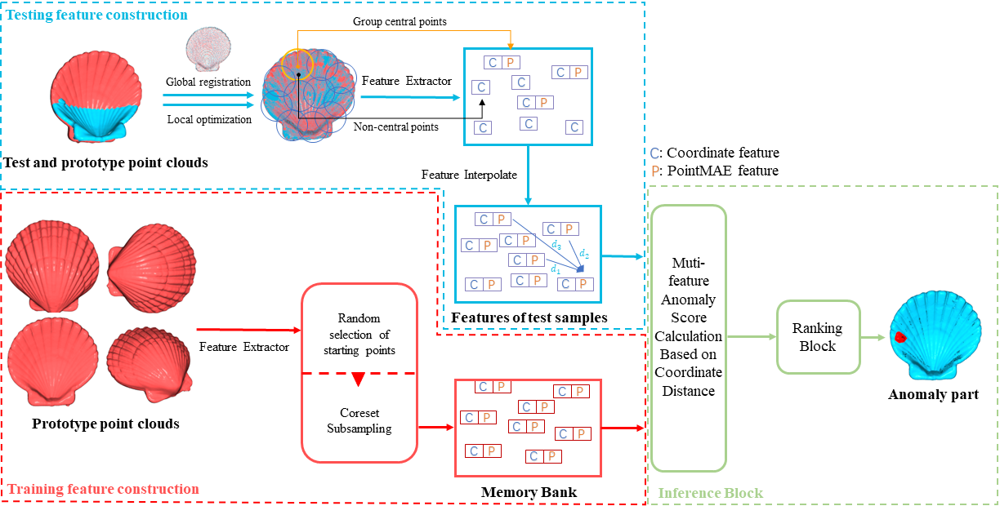

# PointCore: A Coordinate-Dominated Multi-Feature Joint Decision Model for Rapid Anomaly Detection in Point Clouds

Baozhu Zhao, Qi Liu†

# Overview

We propose the Coordinate-Dominated Multi-Feature Joint Decision Model (**PointCore**), an unsupervised, fast, and accurate solution for point cloud defect detection. The approach is driven by point cloud coordinates, coupled with PointMAE features to compute anomaly scores for each point cloud. PointCore offers competitive inference times while achieving state-of-the-art performance for both detection and localization. On the challenging, latest released Real-3D-AD benchmark, PointCore achieves an Object-level anomaly detection AUROC score of up to 82.97\%.

# PointCore Architecture




# Dataset and Requirements

To download the Real3D dataset, please refer to [Real3D Dataset](https://github.com/M-3LAB/Real3D-AD).

To install the requirements, please refer to [requirements](https://github.com/M-3LAB/Real3D-AD#how-to-reproduce-our-benchmark).

### Checkpoint preparation

We have prepared all the checkpoints needed and provided a [Google drive download link](https://drive.google.com/file/d/1HvT0Z3022jNUbSwQezy11CvUFLcMdluY/view?usp=drive_link)

Download checkpoints.zip and extract into ./checkpoints/

```bash
├── checkpoints
│   ├── Point-BERT.pth
│   ├── pointmae_pretrain.pth
│   ├── pretrain.pth
│   └── wide_resnet50_racm-8234f177.pth
```

## How to use

You can get the results in our paper by running the following command.

```bash
python3 main_pointcore.py --gpu 0 --seed 42 --memory_size 10000 --anomaly_scorer_num_nn 1 --faiss_on_gpu --faiss_num_workers 8 sampler -p 0.1 approx_greedy_coreset
```